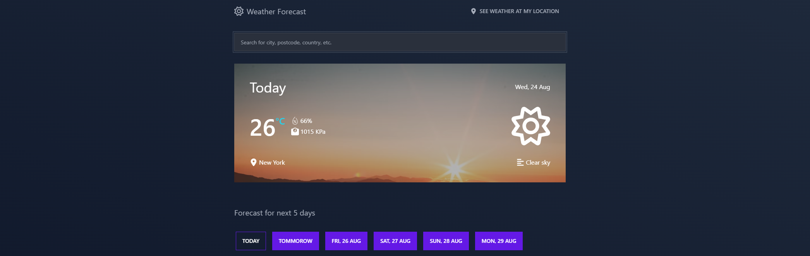

# Weather App



<!-- Demo Page -->

## Application demo

Click the following link to view the application demo:

<!-- TODO: Add demo link -->

<!-- Features -->

## Features

- Current weather data
- 5 Days weather forecast
- User's location weather data
- Search with autocomplete
- Deep linking - application state is stored in URL, so user is able to share the data by sending URL.

<!-- How to run locally -->

## How to run application locally

**Prerequesties**

- [Node.js](https://nodejs.org/en/) installed.
- [Git](https://git-scm.com/) installed.

**Clone the repository**

1. Clone the repository using following script in root directory:

```
git clone https://github.com/MatejVykoukal/weather-app.git
```

**Weather API credentials**

2. Create your account at [Open Weather Map](https://home.openweathermap.org/users/sign_up) to gain your personal API key.

3. Go to [API keys](https://home.openweathermap.org/api_keys) section, copy your key and assing it to `REACT_APP_WEATHER_API_KEY` variable in `sample.env`.

**Address completion API credentials**

4. Create your account at [RapidAPI](https://rapidapi.com/auth/sign-up) to gain your personal API key.

5. Go to [API page](https://rapidapi.com/geoapify-gmbh-geoapify/api/address-completion) choose free subscription plan.

6. Copy X-RapidAPI-Key and assign it to `REACT_APP_ADRESS_API_KEY` variable in `sample.env`.

7. Copy X-RapidAPI-Host and assign it to `REACT_APP_ADRESS_API_HOST` variable in `sample.env`.

**.env file**

8. Rename `sample.env` file to `.env`.

**Dependencies**

9. Install dependencies using following script in root directory:

```
npm install
```

**Run the application**

10. Run the application using following script in root directory:

```
npm start
```

<!-- Used technologies -->

## Used technologies

- Application is developed using [React](https://reactjs.org/) + [Typescript](https://www.typescriptlang.org/) in core.
- Weather data comes from public API - [Open Weather Map](https://openweathermap.org/).
- The is also used second public API - [Adress Completion](https://rapidapi.com/geoapify-gmbh-geoapify/api/address-completion) to cover wider range of searchable places.
- Application states are managed using React hooks and contextAPI.
- UI is styled using [TaiwindCSS](https://tailwindcss.com/).

## Developer notes

### Icon system

- You can use `<Icon>` component to render icons all over the app.
- To see complete list of available icons check `src/components/Icon/Icon.tsx` file.

**Add new icon**

1. Paste svg icon into `src/svg/icons` folder.

2. Run `npm run svg` command in the root directory.

> Note: Don't forget to extend `IconType` in `src/components/Icon/Icon.tsx` coresponding to icon filename to prevent Typescript aletrs.

<!-- File structure -->

### File structure in `src`

#### `components`

- Each component is placed in particular folder name and file named same as component.
- Component names are capitalized.
- Component is exported from idex.ts file located in the component folder.

**Sample structure:**

```
components
  >Button
    >index.ts
    >Button.tsx
```

#### `contexts`

- Everything related to contextAPI is located here.

#### `svg`

- Folder for svg icons.

#### `types`

- Most of types located here. Types are structured in particular files.

#### `utils`

- Utility functions used across app are located here.

#### `constants.ts`

- File for storing global constants.

## License

- Licensed uder [MIT]()
